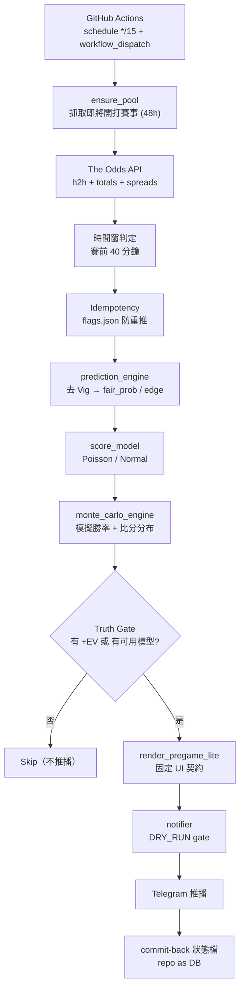

# 🎯 精算師預測系統 · sports-prediction-bot

> 一個以 **GitHub Actions** 為核心、會在賽前自動把量化分析推播到 **Telegram** 的 AI 賽事預測系統。


支援賽事：⚾ **MLB** · 🏀 **NBA** · ⚽ **FIFA 世界盃**

-----

## 📖 專案介紹

### 這個系統解決什麼問題

博彩公司的賠率包含「抽水（vig）」，直接看賠率無法得知**真實勝率**，更看不到比分分布、下注優勢與資金控管建議。本系統把這整套量化分析**自動化**，並在比賽開打前主動推播到你的 Telegram。

### 為什麼建立這個系統

- 不想每場手動算去 vig、Edge、Kelly。
- 想要「有訊號才通知」，而不是被一堆無意義訊息洗版。
- 不想架伺服器：用 GitHub Actions 排程 + repo 當資料庫，**零主機成本**即可長期運行。

### 與一般賽事分析有什麼不同

- **去 Vig 真實勝率**：還原博彩抽水後的機率，而非直接讀賠率。
- **模型推得的比分分布**：用 Poisson / 常態模型 + 蒙特卡羅，而非主觀猜測。
- **Truth Gate 防洗版**：沒有可下注訊號時，系統會「合法地不推播」。
- **資料即真相**：缺資料一律顯示 `N/A`，永不捏造數字。

-----

## ✨ 核心特色

|特色                    |說明                         |對應模組                          |
|----------------------|---------------------------|------------------------------|
|去 Vig 真實勝率            |移除博彩抽水，還原公平機率              |`prediction_engine`           |
|比分模型（Poisson / Normal）|足球/棒球用 Poisson、籃球用常態 margin|`score_model`                 |
|Monte Carlo 模擬        |由模型參數模擬勝率與比分分布             |`monte_carlo_engine`          |
|Edge 分析               |模型機率 vs 市場賠率的優勢            |`prediction_engine`           |
|Kelly + Risk          |凱利下注比例與風險等級                |`kelly`                       |
|固定 UI 契約推播            |版面固定、缺資料 N/A、不隱藏不捏造        |`notifier.render_pregame_lite`|
|Truth Gate 防洗版        |有 +EV 或有模型才推播              |`sports_prediction`           |
|自動 Telegram 推播        |DRY_RUN 開關控制實送 / 僅 log     |`notifier`                    |
|GitHub Actions 自動執行   |每 15 分鐘排程 + 手動觸發           |`.github/workflows/bot.yml`   |
|Repo State Storage    |repo 內 JSON 當資料庫，跨 run 持久化 |`data_manager`                |

-----

## 📱 推播畫面展示

以下為 `render_pregame_lite` 的**真實輸出格式**（完整，不簡化）：

```
🎯 精算師預測系統
⚡ 量化預測模型（賽前 40 分鐘）
━━━━━━━━━━━━━━━━
📅 台灣時間 06/14 09:10
⚾ MLB
Giants 🆚 Dodgers
━━━━━━━━━━━━━━━━
📐 去Vig真實勝率
Giants  ████░░░░░░  42.0%
Dodgers ██████░░░░  58.0%
蒙特卡羅模擬勝率
Giants  ██░░░░░░░░  24.7%
Dodgers ██████░░░░  63.0%
━━━━━━━━━━━━━━━━
📊 Edge（模型優勢）
Giants -2.0%
Dodgers +3.0%
━━━━━━━━━━━━━━━━
🏆 最可能出現的比分
🥇 Dodgers 4–3 Giants（3.8%）
🥈 Dodgers 5–3 Giants（3.8%）
🥉 Dodgers 4–4 Giants（3.3%）
4️⃣ Dodgers 5–4 Giants（3.3%）
5️⃣ Dodgers 4–2 Giants（3.2%）
━━━━━━━━━━━━━━━━
📊 盤口深度分析
讓分盤口     Dodgers -1.5
總分大小     8.5
獨贏賠率
Giants:2.3
Dodgers:1.72
━━━━━━━━━━━━━━━━
💰 台灣運彩實戰建議
🔮【主推】獨贏 → Dodgers（@ 1.72）
💎【次要】N/A
⭐【備選】N/A
━━━━━━━━━━━━━━━━
📊 風控資訊
- Kelly：0.0%
- Risk Level：低
━━━━━━━━━━━━━━━━
📡 數據來源：AI模型+真實數據+賠率
⚠️ 請理性投注。
```

> 缺資料的欄位顯示 `N/A`；NBA 不輸出精準比分（統計上不適用）。

-----

## 📡 推播機制（雙推播）

每場賽事最多推播兩次，資料來源相同，差別在時間點與標題：

### 第一次推播 — 賽前 12 小時（早盤觀察）

- 時間：賽前約 12 小時（`EARLY_WINDOW_MIN = 720`）
- 用途：早盤觀察、提前掌握方向
- 標題：`🕐 量化預測模型（賽前 12小時預測）`（不顯示 `⚡`）
- 賠率為當下快照，**最終投注以賽前 40 分鐘那則為準**

### 第二次推播 — 賽前 40 分鐘（最終投注參考）

- 時間：賽前 40 分鐘（`PREGAME_WINDOW_MIN = 40`）
- 用途：最終投注參考
- 標題：`⚡ 量化預測模型（賽前 40 分鐘）`（不顯示 `🕐`）

> 早推不寫入賽後驗證池；賽後僅驗證 40 分鐘的最終預測。Odds API 不會因早推增加用量（早推讀的是已快取的盤）。

### 台灣運彩實戰建議

推播包含三項（有資料才填，無則 `N/A`）：

- `🔮【主推】` 獨贏盤 → MC 模型方向（勝率最高的一邊）
- `💎【次要】` 總分大小 → 盤口總分線
- `⭐【備選】` 讓分盤 → 模型讓分

> 說明：主推為 MC 模型方向；次要/備選顯示盤口線值。本系統模型以盤口線為參數，
> **不獨立判斷大小/讓分方向**，故不標「大分/小分・蓋牌」；以上皆「僅供參考，非 +EV 投注建議」，
> 下注比例請看「📊 風控資訊」的 Kelly。可用環境變數 `USE_V1_DECISION=false` 關閉 V1 風格方向顯示。

-----

## 🏗 系統架構



-----

## 📂 專案結構

```
sports-prediction-bot/
├─ src/
│  ├─ constants.py            # 全域常數：支援運動、時間窗(40)、盤口 key、時區
│  ├─ obs.py                  # 結構化 JSON 日誌
│  ├─ data_manager.py         # 原子化 JSON 狀態讀寫；verified_history.csv
│  ├─ data_fetcher.py         # The Odds API client；KeyManager(金鑰池+cooldown)；解析 h2h/totals/spreads
│  ├─ prediction_engine.py    # 市場隱含去 Vig → fair_prob / edge / best_pick
│  ├─ score_model.py          # sport-aware 比分模型（FIFA/MLB→Poisson；NBA→Normal）
│  ├─ monte_carlo_engine.py   # 蒙特卡羅模擬（收斂回 analytic）
│  ├─ kelly.py                # Kelly 下注比例 + 風險等級
│  ├─ notifier.py             # renderers + TelegramSender + make_pusher(DRY_RUN gate)
│  ├─ result_verifier.py      # 賽後結果驗證（moneyline truth）
│  ├─ weekly_report.py        # 週報彙整
│  └─ sports_prediction.py    # 主流程：ensure_pool / run_pregame_push / tick / main
├─ tests/                     # 18 個測試檔（pytest，171 passed）
└─ .github/workflows/
   ├─ ci.yml                  # push / PR / 手動 → pytest
   └─ bot.yml                 # bot-runtime：每 15 分鐘 + 手動 → runtime tick
```

-----

## 🔄 預測流程

```
Fetch Odds → De-vig → Model → Monte Carlo → Edge → Truth Gate → Render → Telegram
```

1. **Fetch Odds**：`data_fetcher` 向 The Odds API 取得賽程與三盤口（h2h / totals / spreads）；金鑰用 `KeyManager` 輪替並在額度受限時 cooldown。
1. **De-vig**：`prediction_engine` 移除抽水，算出 `fair_prob`、`edge`、`best_pick`。
1. **Model**：`score_model` 由 totals + spreads 導出 λ；FIFA/MLB 走 Poisson 比分分布，NBA 走常態 margin（不產精準比分）。
1. **Monte Carlo**：`monte_carlo_engine` 由 λ 模擬大量場次，得勝/平/負與比分分布。
1. **Edge**：模型機率與市場賠率比較，得出下注優勢。
1. **Truth Gate**：`sports_prediction` 判斷「有 +EV 標的 或 有可用模型」才繼續，否則 skip。
1. **Render**：`render_pregame_lite` 依固定 UI 契約組裝訊息（缺資料 N/A）。
1. **Telegram**：`notifier` 經 DRY_RUN gate 決定實送或僅 log；最後 commit-back 狀態檔。

-----

## ⚙️ GitHub Actions

|Workflow       |檔案                         |觸發                                    |用途                                 |
|---------------|---------------------------|--------------------------------------|-----------------------------------|
|**ci**         |`.github/workflows/ci.yml` |push / PR / 手動                        |跑 `pytest -q`（目前 171 passed）       |
|**bot-runtime**|`.github/workflows/bot.yml`|`schedule: */15` + `workflow_dispatch`|執行 runtime tick，結束後 commit-back 狀態檔|


> 兩者完全分離：`ci` 只跑測試，`bot-runtime` 只跑實際流程。

-----

## 🚀 部署教學

### 1. 設定 Secrets

GitHub → Settings → Secrets and variables → Actions：

|名稱              |用途                |必填|
|----------------|------------------|--|
|`ODDS_API_KEY_1`|The Odds API 金鑰   |✅ |
|`ODDS_API_KEY_2`|第二把金鑰（備援/輪替）      |⬜ |
|`TG_TOKEN`      |Telegram bot token|✅ |
|`TG_CHAT`       |Telegram chat id  |✅ |

### 2. DRY_RUN 開關（`bot.yml`）

- `DRY_RUN: "false"` → 真實推播到 Telegram（正式運行）。
- `DRY_RUN: "true"` → 僅 log、不送 Telegram（測試管線用）。

### 3. 手動執行

Actions → **bot-runtime** → **Run workflow**（適合在某場開賽前約 30 分鐘手動驗證推播）。

### 4. 正式上線

設好 Secrets、`DRY_RUN="false"` 後，系統即每 15 分鐘自動運行，無需人工介入。

-----

## 🧪 測試覆蓋

目前 **171 passed**（`pytest -q`）。測試分類：

|類別            |測試檔                                                                                                                             |
|--------------|--------------------------------------------------------------------------------------------------------------------------------|
|比分模型          |`test_score_model`                                                                                                              |
|蒙特卡羅          |`test_monte_carlo`                                                                                                              |
|預測引擎（去 Vig）   |`test_prediction_engine`                                                                                                        |
|Kelly / 風控    |`test_kelly`                                                                                                                    |
|推播渲染 / UI 契約  |`test_pregame_lite`, `test_ui_contract`, `test_render_model_integration`, `test_notifier`, `test_postgame`, `test_weekly_report`|
|資料抓取 / 比分     |`test_data_fetcher`, `test_scores_fetch`                                                                                        |
|主流程 / 時間窗 / 去重|`test_runtime`, `test_time_window`, `test_core`, `test_snapshot`                                                                |
|結果驗證          |`test_result_verifier`                                                                                                          |
|壓力 / 真實情境     |`test_reality_stress`                                                                                                           |

-----

## 🔧 故障排除

|症狀                                                 |根因                                                     |解法                                      |
|---------------------------------------------------|-------------------------------------------------------|----------------------------------------|
|CI `exit code 2`（collection error）                 |某 `src/*.py` 缺副檔名 → import 失敗                          |補回 `.py`（例：`constants` → `constants.py`）|
|runtime `ModuleNotFoundError`                      |同上                                                     |同上                                      |
|commit-back `exit code 128`（pathspec did not match）|狀態檔尚未建立                                                |`git add` 改為容錯（只 add 存在的檔）              |
|跑綠但 Telegram 沒訊息                                   |當下無比賽在 40 分窗內 / 無可下注訊號（Truth Gate skip）/ `DRY_RUN=true`|等比賽進窗、賽前約 30 分手動 Run、確認 `DRY_RUN=false` |
|完全沒抓到比賽                                            |Odds API 金鑰未設或額度用盡                                     |設 `ODDS_API_KEY_1`、檢查 API 額度            |

-----

## 🧰 技術棧

- **Python 3.11**：執行期**僅使用標準庫**（HTTP 用 `urllib.request`；另含 `json` / `csv` / `math` / `random` / `datetime` / `zoneinfo` / `dataclasses` 等）。
- **GitHub Actions**：CI 與 runtime 排程。
- **The Odds API**：賠率與賽程資料來源。
- **Telegram Bot API**：推播輸出。
- **pytest**：測試框架。

> 透明說明：`requirements.txt` 目前另列了 `numpy / pandas / nba_api / pybaseball / xgboost / scikit-learn`，但**現行程式碼並未 import 這些套件**（保留作未來擴充）。實際執行不依賴它們。

-----

## 📊 專案狀態

**完成度：約 92%（可運行、上線級，尚未完全 hardened）**

|項目            |狀態   |證據                                          |
|--------------|-----|--------------------------------------------|
|CI 綠燈         |✅ 已驗證|`pytest` 171 passed                         |
|Runtime 綠燈    |✅ 已驗證|bot-runtime 全流程無 crash                      |
|Import chain  |✅ 已驗證|12 個 `src/*.py` 全部可 import                  |
|Pipeline 全通   |✅ 已驗證|fetch → model → MC → gate → render → push 串接|
|commit-back 穩定|✅ 已修正|`git add` 容錯，狀態檔不存在時自動 skip                 |
|Telegram 真實送達 |⏳ 待驗證|需有比賽進窗的一次 run + 頻道實收                        |

-----

## ⚠️ 免責聲明

本系統為統計分析工具，所有輸出僅供參考，**不構成投注建議**。請理性投注、量力而為。